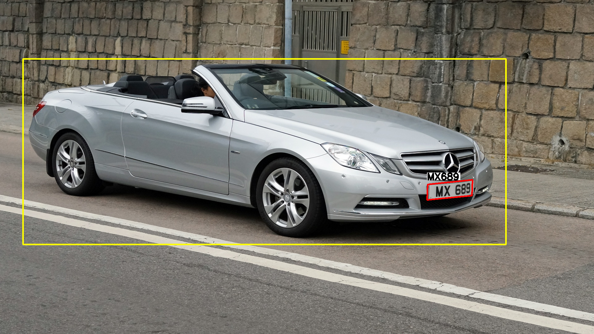
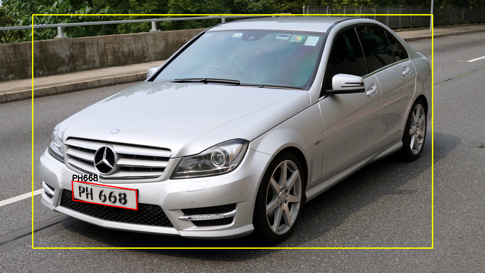
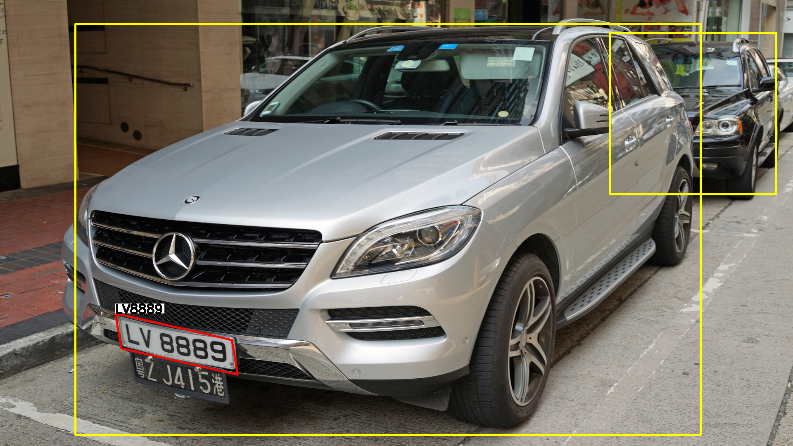
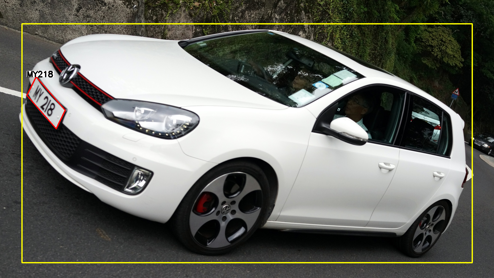

# ALPR using trained OCR model on custom dataset

This repository performs the License Plate Recognition based on this [project](https://github.com/sergiomsilva/alpr-unconstrained). The only modification is the OCR Detection, which is trained on private dataset.

## Overview of ALPR Procedure

- #### Step 1: Detect vehicles
- #### Step 2: Detect license plates
- #### Step 3: OCR

## Requirements

In order to run the code, check if these [libraries](https://github.com/chenghanc/alpr-unconstrained/blob/alpr/version-alpr27) are installed. Darknet framework is self-contained in the `darknet` folder and must be compiled before running the code

- #### darknet (libdarknet.so)
    * Compiled with GPU=1, CUDNN=1, OPENCV=1, LIBSO=1

```shellscript
$ cd darknet && make -j20
```

## Download Models

Download all the trained models (see this repo [alpr-unconstrained](https://github.com/sergiomsilva/alpr-unconstrained))

## Step 1: Vehicle Detection

- #### Use trained Yolo model to perform vehicle detection (see this repo [alpr-unconstrained](https://github.com/sergiomsilva/alpr-unconstrained))

## Step 2: License Plate Detection

- #### Use LP detector trained by this repo [alpr-unconstrained](https://github.com/sergiomsilva/alpr-unconstrained)

## Step 3: OCR Detection

- #### Perform OCR Detection. The model is trained on custom dataset using [darknet](https://github.com/AlexeyAB/darknet)

## Running a simple test

```shellscript
$ bash run-lpr.sh -i samples/test-lpr -o /tmp/output -c /tmp/output/results.csv
```

---

## Example








---

# Appendix

## Appendix-1: ALPR Process

```
Three-Step Approach
====================

Module-1                     Module-2
========                     ========

Vehicles Detection (Yolo)    Plate Detection (WPOD-Net)
------------------           ---------------

* Yolo                       * WPOD-Net
* Network Resolution         * Train WPOD-Net (One-Line Plate)
* (416 x 416)                * Tensorflow 

Module-3
========

OCR Detection (Yolo-OCR-Net)
-------------

* Train Yolo (Characters)  
  ++++++++++++++++++++++++++++++++++
* + Perform OCR on Detected Plates +
  ++++++++++++++++++++++++++++++++++
* Network Resolution 
  (1248 x 704)

  #########################################################
  # Detection Network is adjustable depending on the      #
  # cropped plate size, which in our case is roughly      #
  # (W x H) = (201 x 49). So we can set Detection Network # 
  # Resolution to be (224 x 64) or (288 x 96).            #          
  #########################################################
```

## Appendix-2: ALPR Process Flow

```
Three-Step Approach
====================

  Process Flow for ALPR:
  ======================

         1. Input Image                      
                                             
                |                            
                |  Yolo                          
                |                            |
                v                            |
                                             |
         2. Vehicle Located      (Module-1)  |
                                 ----------  |
                |                            |
                |  WPOD-Net                  |
                |                            | Network Resolution
                v                            | for Detecting Vehicle             
                                             |               =======
         3. Plate Located        (Module-2)  | (416 x 416)      
                                 ----------  
                |                            |
                |  Yolo-OCR-Net              |
                |                            | Network Resolution
                v                            | for Detecting Characters
                                             |               ==========
         4. Characters Predicted (Module-3)  | (288 x 96)
                                 ----------
                |                              adjustable
                |
                |
                v

         5. Plate Prediction
```

## Appendix-3: OCR: One-Step Approach

```
One-Step Approach
==================

* Perform OCR directly: The characters will be detected 
                        directly from the input images

Module-1        
========       

Characters Detection (Yolo)
--------------------

* Train Yolo Model
  +++++++++++++++++++++++++++++++
* + Perform OCR on Input Images +
  +++++++++++++++++++++++++++++++
* Network Resolution 
  (800 x 448)

  Process Flow for Yolo:
  ==========================

         1. Input Image

                |                            | Network Resolution
                |                            | for Detecting Characters
                |                            |               ==========
                v                            | (800 x 448)

         2. Characters Predicted (OCR)         adjustable:
                                 -----         (speed / accuracy)
                |
                |
                |
                v

         3. Plate Prediction
```

